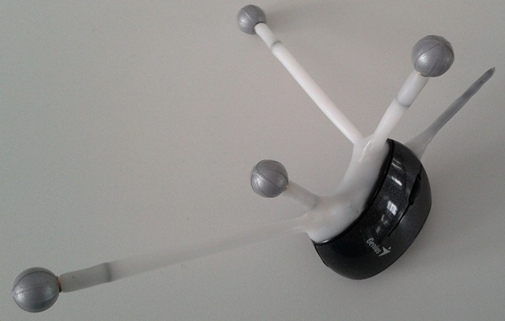

# Building the targets #
If you do not want to build the targets by yourself, look at http://www.ar-tracking.com/products/markers-targets/targets/passive/ or http://iotracker.com/indexfe2b.html?q=rigid_body_targets . Otherwise you can build the targets from objects and markers by yourself as explained in the following.

## Passive spherical markers ##
The most important parts are the reflecting marker balls.

Some manufacturers are ART (http://www.ar-tracking.com/products/markers-targets/markers/passive/), Qualisys (http://www.qualisys.com/products/accessories/passive-markers/) and NDI (http://www.ndigital.com/medical/ndi-passive-reflective-marker-spheres.php)

## Fixation ##
An easy way to attach the markers to an object is to use polymorph granules. It is a plastic that can be melt in water or by a hot air blower to (re-)shape it as (as often as) you want to (see http://www.gyroscope.com/images/polymorph/polymorph.pdf).

By putting screws in the screw threads of the markers and perhaps also into the object itself, the connection is more robust.

In the following figure you can see markers attached to a mouse with polymorph. This object is used as a 3D input (pointing) device and has therefore a peak (created from a nail coated by polymorph).

Important to know is, that the number and arrangement of the markers should be such that at least 4 markers can be seen (and therefore detected) by the cameras. Otherwise the object cannot be detected correctly.

# Object calibration #
In order to track the targets, TIY needs to know the exact arrangement of the markers attached it. This can easily be done by the following steps:

  1. For each object, log the 3D points of at least 10-15 different positions and orientations of the markers attached to one object. This can be done with the TIY _server_ example by activating the _<do_log_3D>_ option in the _config_run_parameters.xml_ configuration file and pressing the SPACE key (or left mouse click if mouse used) at each pose. The log file, defined by _<log_points_3D>_, is stored in the _tiy_log_ folder in the home or TIY bin directory. For each object, rename the log file to _capture_template_X.dat_ (replace X by 1,2,...) before restarting the _server_ program for the next object. Important: During the logs only the 3D points of one object are allowed to be detected by the system.
  1. Move the log files to the _tiy_calibration/marker_object_calibration_ folder.
  1. Replace the _config_object.xml_ file there with your file from the TIY folder. Run the _make_templates_from_3dpoints.m_ script (takes some time when using octave) to write the calibration data into the _config_object.xml_ file and copy the changed configuration file back to the TIY folder.
  1. If you also need to define a virtual point (a point fixed to the object without a marker that you want to track; e.g. the peak of the 3D device in the figure above), do all the steps again, except for turning the object around the fixed (in position) virtual point while logging and using _capture_virt_point_X.dat_ and _make_virtual_point.m_ .
